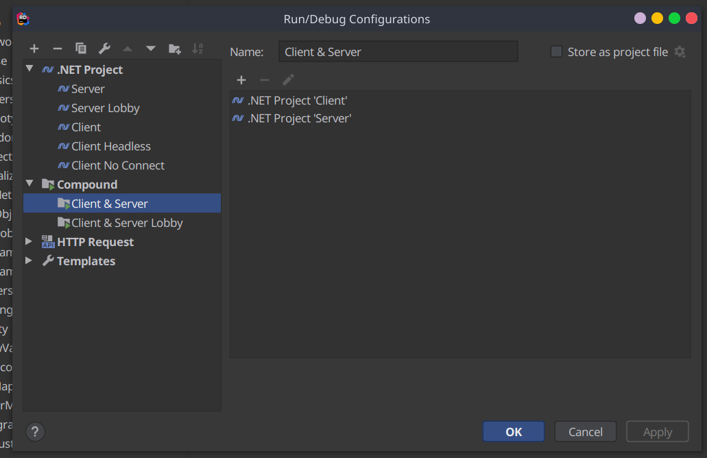
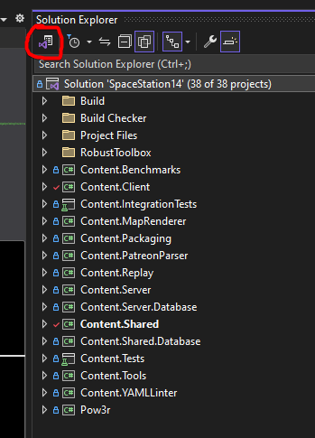
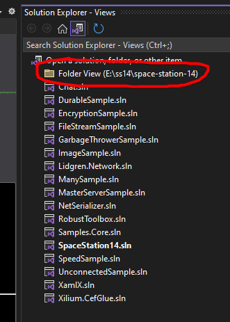
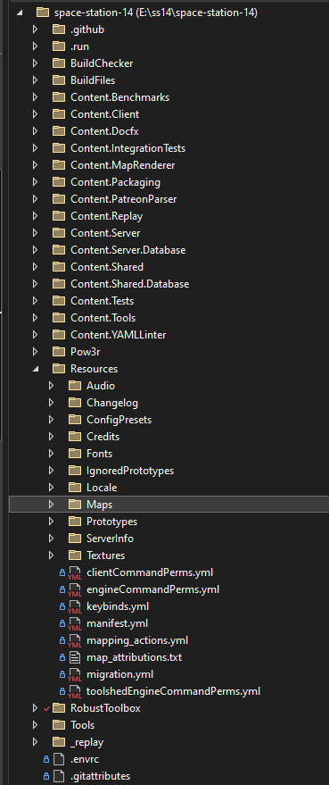
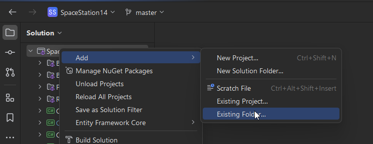
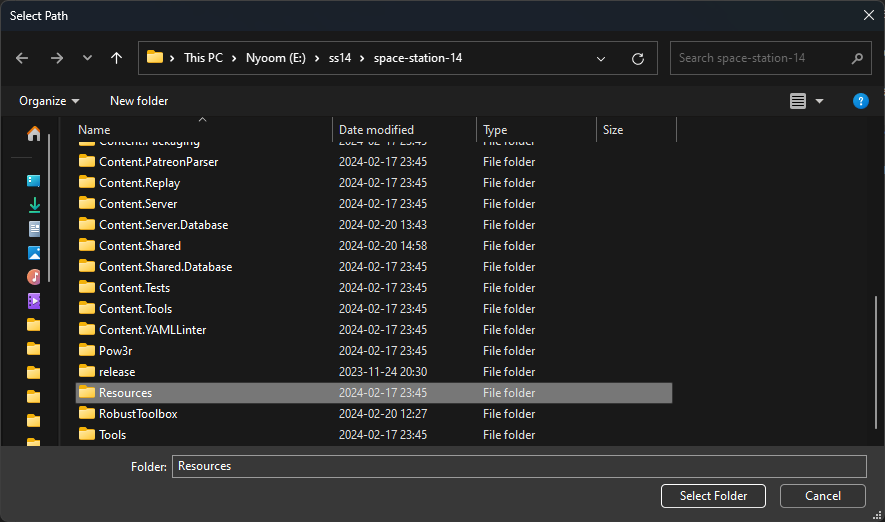

# Настройка среды разработки

Для начала вам понадобится некоторое программное обеспечение:

* [Git](https://git-scm.com/) или одно из [многих](https://www.sourcetreeapp.com/) [сторонних](http://www.syntevo.com/smartgit/) [интерфейсов](https://tortoisegit.org/), которые облегчают его использование. Убедитесь, что он устанавливается в ваш PATH, как [это](../../assets/images/setup/git-path.png).
* [Python 3.7 или выше](https://www.python.org/). Убедитесь, что он установлен в ваш [PATH в Windows](../../assets/images/setup/python-path.png). Также убедитесь, что опция 'py launcher' включена при установке на Windows. Вы можете скачать python с сайта [python.org](https://www.python.org/). Версии, установленные из Windows Store, иногда вызывают проблемы со сборкой.
* [.NET 8.0 SDK](https://dotnet.microsoft.com/download/dotnet/8.0). Visual Studio также устанавливает его, если вы работаете под Windows.
  * ARM (M1) Пользователи Mac: Вы должны убедиться, что установили x64 .NET, **не** ARM .NET. В настоящее время движок не работает на Mac ARM, поэтому рекомендуется использовать x64 через эмуляцию Rosetta 2. 
* Желательно наличие IDE, чтобы разработка не была мучительной (все варианты бесплатны, если не указано иное):
  * Для **Windows**, [Visual Studio 2022 **Community**](https://www.visualstudio.com/). Для минимальной установки (О боже, какой он большой) вам понадобится .NET desktop, компилятор C#, поддержка C#, менеджер пакетов NuGet, MSBuild и .NET 8 SDK или что-то в этом роде.
  * Для **macOS** - [Visual Studio for Mac](https://docs.microsoft.com/ru-us/visualstudio/mac/).
  * Для **всех платформ**, (НЕ БЕСПЛАТНО) [Rider](https://www.jetbrains.com/rider/) - одна из лучших доступных IDE, и многие разработчики предпочитают её Visual Studio. Студенты колледжей/университетов(в основном европейских и американских) могут получить бесплатную образовательную лицензию, даже если они не изучают информатику.
  * Для **всех платформ**, [Visual Studio Code](https://code.visualstudio.com/) с расширением C#. Обычно уступает полноценным IDE, таким как обычная Visual Studio, но некоторым опытным программистам нравится минимализм.
    * **Эксклюзивно для VSCode/VSCodium**: вы можете установить расширение [Robust YAML](https://marketplace.visualstudio.com/items?itemName=slava0135.robust-yaml), созданное нашим сообществом, для улучшения работы Robust Toolbox с YAML поверх расширения [YAML Language Support](https://marketplace.visualstudio.com/items?itemName=redhat.vscode-yaml).
  * Для **всех платформ**, [VSCodium](https://vscodium.com/) с расширением C#. С открытым исходным кодом и без раздутости и отслеживания VSCode.

## 1. Клонирование

**Даже если вы уже знакомы с Git, прокрутите страницу вниз, чтобы прочитать раздел о настройке сабмодулей. Серьезно.**

Если вы **знакомы с Git**, просто форкните и клонируйте репозиторий, настройте ремоуты, а затем следуйте руководству по сабмодулям ниже.

Если вы **не знакомы с Git** или просто не знаете, как действовать, следуйте руководству [Git для разработчиков SS14](./git-for-the-ss14-developer.md), в котором подробно рассказывается о том, как внести свой вклад в игру и как создать свой начальный репозиторий. В нем также затрагивается настройка подмодулей, но это также включено сюда из-за его важности.

## 2. Настройка сабмодулей

У нас есть автоматический апдейтер сабмодулейй, так что вам не придётся постоянно запускать `git submodule update --init --recursive`. 

Запустите `RUN_THIS.py` внутри репозитория с помощью Python. Желательно также из терминала. Это должно занять несколько секунд, так что если он мгновенно остановится, проверьте, не используете ли вы Python 3.7+, иначе продолжайте читать.

**Если при запуске `RUN_THIS.py` сразу открывается и закрывается окно: не волнуйтесь**. Это не означает, что скрипт не сработал. Скрипт автоматически закрывается по завершении, поэтому, если вы хотите проверить, что он сработал правильно, проверьте подмодуль `/RobustToolbox/` и убедитесь, что все файлы там есть. Если нет, посмотрите категорию устранение неполадок в нижней части этой страницы.

Примечание: Если у вас возникли проблемы с отсутствием файлов, рекомендуется запустить `git submodule update --init --recursive` вручную один раз, на случай если что-то пошло не так с python.

Если же вы хотите модифицировать движок напрямую или обновлять сабмодуль вручную (автообновление может быть неприятным), создайте файл `DISABLE_SUBMODULE_AUTOUPDATE` в директории `BuildChecker/`. 

И все, теперь ваше репо настроено должным образом!

## 3. Настройка среды разработки

### Visual Studio

1. Скачайте Visual Studio Community (если у вас нет платной версии) [здесь](https://visualstudio.microsoft.com/vs/community/)
2. Запустите программу установки и выберите `.net desktop development`, затем установите.
3. Если программа установки спросит вас о среде разработки, выберите `Visual C#`.
4. Откройте Visual Studio
5. Выберите `Открыть проект или решение`, затем перейдите в клонированный репозиторий и откройте файл `SpaceStation14.sln`.

### JetBrains Rider
1. Установите Rider, мы рекомендуем использовать [Jetbrains Toolbox](https://www.jetbrains.com/toolbox-app/), чтобы он мог автоматически обновляться в будущем.
2. Выполните настройку.
3. Нажмите «Открыть» и выберите `SpaceStation14.sln`.
4. Если вы планируете заниматься разработкой движка, необходимо добавить Robust Toolbox в Directory Mappings, чтобы Riders VCS мог обнаруживать изменения в Robust.
   Откройте настройки Riders, перейдите в раздел Version Control > Directory Mappings и нажмите кнопку с плюсом (+). Для Directory укажите на папку `RobustToolbox` в проекте и Git в качестве VCS

### VSCodium
1. Скачайте [VSCodium здесь](https://vscodium.com/) или напрямую [на Github здесь](https://github.com/VSCodium/vscodium/releases) (В последней версии нажмите на выпадающий список активов, затем прокрутите до ZIP или .exe для вашей ОС).
2. Запустите программу установки или распакуйте zip-файл в выбранное вами место и запустите .exe после извлечения.
3. После установки перейдите на вкладку «Расширения» (она на панели в левом верхнем углу, выглядит как 4 плитки) и найдите «C#». Расширение от «Muhammad-Sammy» с более чем 70K загрузок и зелёным / белым логотипом - это то, что нужно, установите его. ID расширения `muhammad-sammy.csharp`.
4. Выберите File > Open Folder (Файл > Открыть папку), перейдите в клонированный репозиторий и откройте эту полную папку.
5. Когда появится запрос на открытие решения, выберите `SpaceStation14.sln`. В качестве альтернативы установите в настройках рабочего пространства параметр `dotnet.defaultSolution` замените на `SpaceStation14.sln`.
6. Теперь вы можете запустить и отладить свою игру. Выберите значок «Запуск и отладка» над «Расширениями» и в выпадающем списке рядом с зелёной кнопкой воспроизведения выберите «Сервер/клиент». Это запустит и клиент, и сервер, открыв игру для отладки. Соответствующая информация появится в отладке внизу. Выберите процессы в стеке вызовов слева, чтобы изменить то, что вы отлаживаете.

## 4. Запуск SS14

Теперь вы можете приступить к компиляции клиента и сервера! С помощью IDE откройте файл решения `SpaceStation14.sln` и нажмите кнопку сборки.

Чтобы скомпилировать без IDE, запустите команду `dotnet build` в каталоге репозитория Space Station 14. Затем вызовите следующие команды для запуска клиента и сервера.
* `dotnet run --project Content.Server`
* `dotnet run --project Content.Client`.

Обе эти команды по умолчанию используют отладочную конфигурацию для дебага. Чтобы включить конфигурацию для серверов, добавьте `--configuration Release` к dotnet.
 
Примечание: Если у вас возникли проблемы с тем, что dotnet не находит libssl (например, при использовании libressl), попробуйте установить переменную окружения `CLR_OPENSSL_VERSION_OVERRIDE` в соответствующую версию. Например, установите значение `48`, если ваш `/usr/lib` содержит `libssl.so.48`.
Если это не сработает, вы также можете попробовать запустить `ln -s /usr/lib/libssl.so /usr/local/lib/libssl.so.1.0.0` вместо этого.

## 5. Настройка параметров сборки

Клиент и сервер SS14 являются независимыми проектами, но оба могут запускаться одной кнопкой в вашей IDE. Однако это необходимо настроить. Примечание: **При разработке в IDE рекомендуется запускать `Content.Client` и `Content.Server`.** *Не* `Robust.Client` или `Robust.Server`. Причина в том, что запуск `Content.*` позволит вашей IDE правильно определить зависимости и обеспечить хорошую пересборку. Если вы запустите `Robust.Client` напрямую, вам придётся каждый раз убеждаться, что решение полностью собрано, что раздражает и о чем легко забыть. Если вы не знаете, что такое Robust или Content, посмотрите [эту страницу](../codebase-info/codebase-organization.md) о том, как организован проект.

### Visual Studio 2022

В Visual Studio 2022 вы можете настроить кнопку сборки на запуск как сервера, так и клиента, щёлкнув правой кнопкой мыши на решении и выбрав `Configure StartUp Projects...`. В появившемся меню выберите `Multiple startup projects:` и установите действие для `Content.Client` и `Content.Server` на `Start`. После применения изменений нажатие на большую кнопку `Start` с зелёной стрелкой должно запустить одновременно и клиент, и сервер.

Примечание: Если у вас возникли проблемы с тем, что программа не собирается правильно, вам может понадобиться установить параметр always build before run. Перейдите в Options `Projects and Solutions/Build and Run` и измените `On Run, when projects are out of date` на `Always build`.

В VS вы также можете использовать клавиши F7 для сборки проекта и F5 для его запуска.

### Visual Studio Code

Расширение C# предоставляет тип запуска `«coreclr»`, который можно использовать для запуска исполняемых файлов `Content.Server` и `Content.Client` в соответствующих каталогах `bin/`. Для одновременного запуска сервера и клиента можно использовать [составную конфигурацию запуска](https://code.visualstudio.com/Docs/editor/debugging#_compound-launch-configurations).

### Командная строка

Соберите с помощью `dotnet build` и запустите клиент и сервер в разных командных строках с помощью:

* `dotnet run --project Content.Server`
* `dotnet run --project Content.Client`.

Также наверняка есть способ запускать две команды одновременно, но вам, вероятно, стоит погуглить.

### JetBrains Rider

В Rider вы можете создать «составную конфигурацию» для одновременного запуска или отладки клиента и сервера. Очень удобно!



## 6. Настройка каталогов IDE

C# IDE, такие как Visual Studio и Rider, не отображают автоматически папку `Resources` в проекте. Эта папка содержит все файлы, не относящиеся к C#, такие как спрайты, аудио и, самое главное, прототипы YAML. В этой категории мы расскажем, как сделать так, чтобы эта папка появилась в вашей IDE, и вы могли легко с ней работать.

### Visual Studio 2022

В Visual Studio вы можете переключить **Solution Explorer** с вида «решение» (показывает только проекты C#) на вид «папка» (показывает все файлы в проекте). Нажмите кнопку для переключения вида следующим образом, а затем выберите вид папки:




После этого проводник решений должен выглядеть примерно так, и вы должны иметь возможность легко получить доступ к папке `Resources`:



### JetBrains Rider

В Rider вы можете «прикрепить» каталог ресурсов к решению. Для этого щёлкните правой кнопкой мыши решение в проводнике, затем выберите «Add» -> «Existing Folder...». Выберите каталог «Resources» в папке выбора файлов.




После этого вид вашего решения должен выглядеть примерно так, и вы должны иметь возможность легко получить доступ к папке `Resources`:


### Visual Studio Code

Visual Studio Code показывает все файлы по умолчанию, так что никаких дополнительных настроек здесь не требуется.

# Воспроизводимая среда разработки с Nix/NixOS

Более простым способом создания среды разработки для пользователей Linux является использование Nix. Nix - это менеджер пакетов и функциональный язык, позволяющий декларировать все, что угодно, от сред разработки до целых систем. Чтобы избежать страшной проблемы «это не работает на моей машине», мы можем объявить среду разработки в Nix, которая порождает изолированную воспроизводимую оболочку.

## Настройка Nix/NixOS с помощью flakes

Вы можете [установить Nix](https://nixos.org/download) либо через установку самого дистрибутива NixOS, либо с помощью скрипта, который совместим со всеми дистрибутивами Linux, использующими systemd (Ubuntu, Fedora, Mint и т.д.). Для простоты и удобства рекомендуется установить Nix в дистрибутив, с которым вам удобно работать, а не переходить на другую операционную систему. Также возможно использование Nix с MacOS через `nix-darwin`, но этот вариант пока не тестировался и поэтому не рассматривается в этой статье.

После установки Nix вам следует включить экспериментальные функции, такие как flakes. Если вы работаете на дистрибутиве, отличном от NixOS, вы можете просто добавить следующее в `~/.config/nix/nix.conf`.

* `experimental-features = nix-command flakes`.

Если вы используете NixOS, вам нужно добавить только эти опции в файл `configuration.nix`.

* `nix.settings.experimental-features = [«nix-command» «flakes» ];`.

Более подробную информацию о том, как включить Nix flakes, можно найти [здесь](https://nixos.wiki/wiki/Flakes).

## Использование Nix flakes для Robust Toolbox

Для NB технически требуется, чтобы у вас уже был установлен Git, но в случае с большинством дистрибутивов Linux он поставляется предустановленным. В крайне маловероятном случае, если у вас его нет:

* Используйте менеджер пакетов вашего дистрибутива.

* Объявите его в файле `configuration.nix`, если вы используете NixOS. Рекомендуется ознакомиться с [соответствующим разделом руководства по NixOS](https://nixos.org/manual/nixos/stable/#sec-configuration-file), но вкратце вам следует добавить `pkgs.git` в атрибут `environment.systemPackages`.

Используя терминал, вы можете просто перейти в корневой каталог вашего репозитория SS14 и запустить:

* `nix develop`.

Nix автоматически обработает все зависимости, объявленные в файле `shell.nix` и вызванные файлом `flake.nix`. У вас появится новая эфемерная оболочка (известная как `devShell`), в которой установлено все, что нужно для сборки SS14 из исходников.

Это остаётся причиной, по которой флейки настоятельно рекомендуются, несмотря на то, что считаются экспериментальной функцией. Мы можем убедиться, что все имеют одинаковые версии зависимостей, указав версию коллекции nixpkgs во входном атрибуте flake и заблокировав версии в файле `flake.lock`. Таким образом, все участники, использующие Nix/NixOS, получают абсолютно одинаковую среду разработки. Без каламбура, но это довольно надёжно!

## (Опционально) Запуск JetBrains Rider через Nix.

После этого вы можете использовать редактор или IDE по своему усмотрению. Однако в уже созданной оболочке вы можете просто указать, что вам требуется JetBrains Rider. Выполните эту команду в вашей devShell.

* `NIXPKGS_ALLOW_UNFREE=1 nix shell nixpkgs#jetbrains.rider --impure`.

Из новой оболочки вы можете запустить «отсоединённый» процесс JetBrains Rider, выполнив что-то вроде:

* `nohup rider >/dev/null 2>&1 &`

И вуаля! Вы надёжно настроили свою среду разработки таким образом, чтобы не накапливать «состояние». Вы практически можете работать над SS14 из любого дистрибутива Linux (при условии, что они используют systemd) без необратимых изменений в вашей системе.

# Устранение неполадок

Убедитесь, что [первые три пункта](#setting-up-a-development-environment) сверху загружены.

## `RUN_THIS.py` не запускается
Проверьте, что python установлен с веб-сайта, а не из Microsoft Store. Если он установлен из Microsoft Store, удалите его, а затем скачайте и установите с сайта python.

Если вы работаете под Windows и перенаправляетесь в Microsoft Store или получаете сообщение в терминале о том, что Python не установлен. Эта проблема может быть вызвана глупым ярлыком Microsoft. Его можно отключить, найдя в поиске `Manage App Execution Aliases` и отключив две ссылки на python

### py not found
Если python был установлен с сайта и команда `python` работает, но вы все равно получаете ошибку «py не установлен», то проверьте, работает ли `C:\WINDOWS\py.exe`. Если да, то добавьте `C:\WINDOWS` в свой путь.

## System.DllNotFoundException: Unable to load DLL 'freetype6' or one of its dependencies: The specified module could not be found.

```PS C:\Users\Larme\Downloads\space-station-14> dotnet run --project Content.Client
Unhandled exception. Robust.Shared.IoC.Exceptions.ImplementationConstructorException: Robust.Client.Graphics.FontManager threw an exception inside its constructor.
 ---> System.DllNotFoundException: Unable to load DLL 'freetype6' or one of its dependencies: The specified module could not be found. (0x8007007E)
   at SharpFont.FT.FT_Init_FreeType(IntPtr& alibrary)
   at SharpFont.Library..ctor()
   at Robust.Client.Graphics.FontManager..ctor(IClyde clyde) in C:\Users\Larme\Downloads\space-station-14\RobustToolbox\Robust.Client\Graphics\FontManager.cs:line 33
   --- End of inner exception stack trace ---
   at Robust.Shared.IoC.DependencyCollection.BuildGraph() in C:\Users\Larme\Downloads\space-station-14\RobustToolbox\Robust.Shared\IoC\DependencyCollection.cs:line 348
   at Robust.Shared.IoC.IoCManager.BuildGraph() in C:\Users\Larme\Downloads\space-station-14\RobustToolbox\Robust.Shared\IoC\IoCManager.cs:line 271
   at Robust.Client.GameController.InitIoC(DisplayMode mode) in C:\Users\Larme\Downloads\space-station-14\RobustToolbox\Robust.Client\GameController\GameController.IoC.cs:line 16
   at Robust.Client.GameController.ParsedMain(CommandLineArgs args, Boolean contentStart, IMainArgs loaderArgs, GameControllerOptions options) in C:\Users\Larme\Downloads\space-station-14\RobustToolbox\Robust.Client\GameController\GameController.Standalone.cs:line 49
```

Удалите .NET Core SDK x86. Установите .NET Core SDK x64.


## Клиент и сервер недоступны в Visual Studio для настройки в проекте Multiple startup.

Это может быть связано с тем, что вы открыли проект как папку, а не как решение. Убедитесь, что вы открыли его как решение и щёлкните файл .sln космической станции 14.

## Система не может найти указанный файл RUN_THIS.py

Ошибка `The system cannot find the specified file` обычно означает, что OneDrive конфликтует с git-репозиторием. Клонируйте git-репозиторий за пределами OneDrive или отключите синхронизацию для клонированной папки.