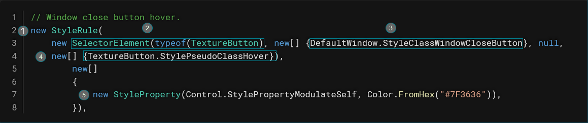

# Руководство по выживанию в UI

## Учимся ходить перед тем, как бежать
Вы решили отправиться в суровую пустыню разработки UI и работы со стилями?

Отлично!

Но прежде чем вы сможете начать ~~жертвовать щенками~~ создавать крутые интерфейсы с использованием нашей UI-системы, вам нужно научиться создавать базовый макет интерфейса. Рекомендую сначала прочитать [документацию по базовому интерфейсу пользователя](../robust-toolbox/user-interface.md).

## Быстро и грязно (Использование FancyWindow)

```admonish quote
Грань между жизнью и смертью определяется тем, на что мы готовы пойти.
- Беар Гриллс
```

Ваш интерфейс не требует сложного магического оформления, но вы хотите, чтобы он выглядел как финальные макеты на нашей [странице в Figma](https://www.figma.com/file/KE5eKymegsLrsQdjZGbTIs/UI?node-id=0%3A188)?

Вам повезло! Вы можете обойтись использованием `FancyWindow` вместо `DefaultWindow`!

Чтобы использовать его, просто измените:
```xml
<DefaultWindow xmlns="https://spacestation14.io" ... >
  ...
</DefaultWindow>
```
на:
```xml
<ui:FancyWindow xmlns="https://spacestation14.io" 
                xmlns:ui="clr-namespace:Content.Client.UserInterface"
                ... >
  ...
</ui:FancyWindow>
```
Возможно, потребуется подправить отступы, но в итоге вы получите действительно стильное окно.

## Учимся у тех, кто выжил

Делая первые шаги в пустыне UI, обратите внимание на то, как храбрые разработчики интерфейсов, пришедшие до вас, справились с этим суровым окружением.

Одним из лучших примеров является [GravityGeneratorWindow](https://github.com/space-wizards/space-station-14/blob/master/Content.Client/Gravity/UI/GravityGeneratorWindow.xaml).

Там содержатся базовые классы стилей, которые вы можете использовать в своём интерфейсе, такие как: `StatusFieldTitle` для меток и `OpenRight\OpenLeft` для кнопок.

Просто скопируйте атрибут `StyleClasses="..."` в свой UI-компонент, чтобы воспользоваться ими.

Когда вы видите красивый интерфейс с нужным вам элементом, оформленным в XAML, попробуйте просто скопировать его и посмотреть, поможет ли это.

## Копаем глубже

```admonish quote
Награды дикой природы и награды выжившего достаются тем, кто способен копать глубже, а в конечном итоге — тому, кто может остаться в живых.
- Беар Гриллс
```

Вы использовали `FancyWindow` и ~~украли код~~ посмотрели стили из других интерфейсов, но это всё ещё недостаточно **стильно**?

Тогда у вас нет другого выбора, кроме как отправиться в опасные земли кода стилей. *\*включается драматическая музыка\**

Взглянув на [StyleNano.cs](https://github.com/space-wizards/space-station-14/tree/master/Content.Client/Stylesheets/StyleNano.cs), вы будете ~~напуганы~~ ошеломлены его 1318 строками кода.

`StyleNano` в основном состоит из трёх вещей:
- Объявления переменных/констант
- Классы стилей, написанные трудночитаемым способом
- Классы стилей, написанные легкочитаемым способом

Вы **хотите** писать новые классы стилей легкочитаемым способом, но вам также нужно понять трудночитаемый способ, чтобы разбираться в уже существующих классах.

Можете спокойно пропускать все объявления переменных и констант до тех пор, пока не дойдёте до следующих строк (сейчас это строка 465):
```cs
    Stylesheet = new Stylesheet(BaseRules.Concat(new[]
    {
```
Это объявление стилей, куда идут все классы стилей.

Здесь (и в аналогичной структуре в [StyleBase.cs](https://github.com/space-wizards/space-station-14/tree/master/Content.Client/Stylesheets/StyleBase.cs)) вы можете посмотреть существующие и добавлять свои классы стилей.

### Трудночитаемый способ объявления класса стиля

В настоящее время большинство классов стилей написаны трудночитаемым способом, например:


1. Новые классы стилей создаются путём создания экземпляра класса `StyleRule`.
2. Тип элемента управления задаётся с помощью создания экземпляра `SelectorElement` с типом класса элемента управления.
3. Затем задаются названия классов стилей в виде массива строк (например, `StyleClassWindowCloseButton` — это просто строковая константа).
4. Четвёртым параметром конструктора `SelectorElement` является псевдокласс, который можно использовать, например, для состояний при наведении мыши. Этот параметр может быть null.
5. Вторым параметром конструктора `StyleRule` является массив свойств стиля. Конструктор `StyleProperty` принимает название свойства в виде строки (обычно это строковая константа внутри элемента управления, который вы хотите стилизовать) и значение, которое вы хотите присвоить этому свойству.

### Легкочитаемый способ объявления класса стиля

```csharp
Element<PanelContainer>().Class("BackgroundDark")
                    .Prop(PanelContainer.StylePropertyPanel, new StyleBoxFlat(Color.FromHex("#25252A"))),
```
1. `Element<PanelContainer>` и `.Class("BackgroundDark")` указывают тип элемента управления и класс, к которому вы хотите применить стиль.
2. `.Prop(PanelContainer.StylePropertyPanel, new StyleBoxFlat(Color.FromHex("#25252A"))` задаёт значение свойства, где первый аргумент — это свойство, а второй — его значение. В данном случае задаётся цвет фона для контейнера панели.

## Скрытые опасности

```admonish quote
Но дикая природа непредсказуема, всё случается тогда, когда меньше всего этого ожидаешь.

- Беар Гриллс
```